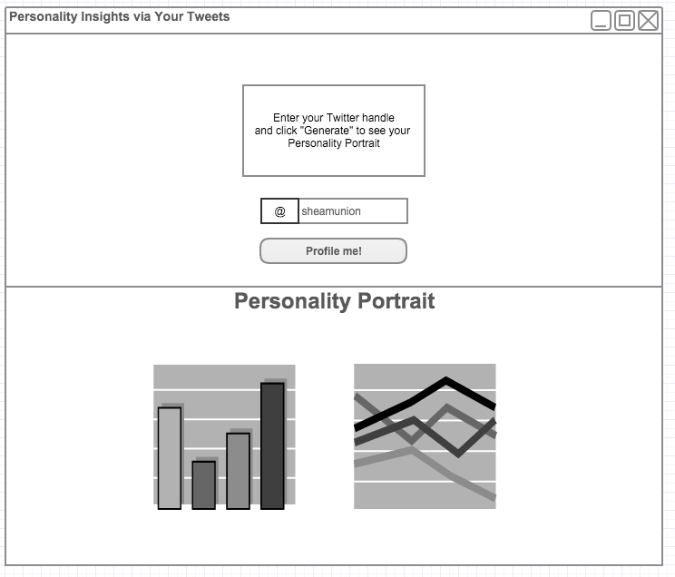

# Insights Via Tweets

## Overview

The goal of this project is to leverage IBM Watson's Personality Insights service to analyze user content and generate a personality profile. [Here is a demo](https://watson-pi-demo.mybluemix.net/) of the service.

As of 1/25/16 a simple CRUD application has been built using Node.js, Express.js, Jade, and MongoDB. It is the current stage of a solo project started at DevBootcamp over the weekend between Week 1 and Week 2 of Phase 3.

## High Level Explorationt

Over that weekend, before defining the goal and scope of this project, I explored many different APIs and services.

* Soundcloud
* Facebook
* IBM Watson Services
* Twitter API
* OpenData
* Google APIs
* Amazon Web Services

## Deep Dive

After defining the project goal and scope, I spent many hours diving deeper into the tech required to build the desired app, including:

* MongoDB
* Express.js
* Node.js
* Promises
* Q.js
* Jade
* Codecademy API and Twitter API tutorials
* JQuery

## Result of Weekend

* Built a functioning CR_D app by way of a tutorial using MongoDB, Express.js, Node.js, and Jade.
* Learned how to use the Twitter API.
* Developed a beginners understading of IBM Watson Bluemix and Personality Insights service.
* Deepend my knowledge of JS and Asynchronous JS.
* Expanded my awareness of available APIs and Web Services.
* Broadened my knowledge and understanding of several technologies.

## Next Steps

The next evolution will enable a user to provide their Twitter handle, have many of their recent Tweets analyzed, and a see their personality profile on the same page.

